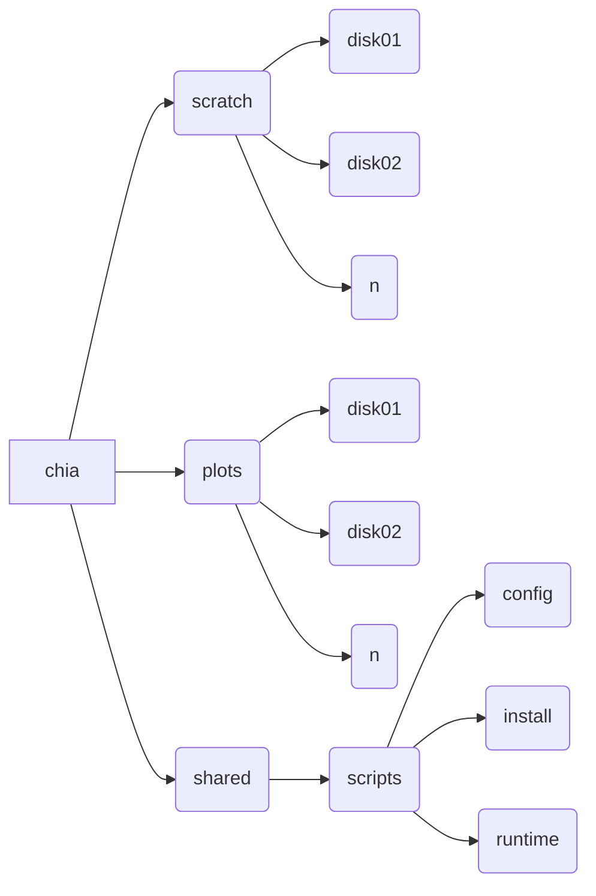

# Chia Utils
Collection of my Chia Blockchain Utils
## Prerequisites
For re-used without changing paths, scripts assume the following folder structure.

```mermaid
graph LR
A[chia]
A --> C(scratch)
C --> C1(disk01)
C --> C2(disk02)
C --> C3(n)
A --> D(plots)
D --> D1(disk01)
D --> D2(disk02)
D --> D3(n)
A --> E(shared) --> F(scripts) --> G(config)
F(scripts) --> H(install)
F(scripts) --> I(runtime)
```
